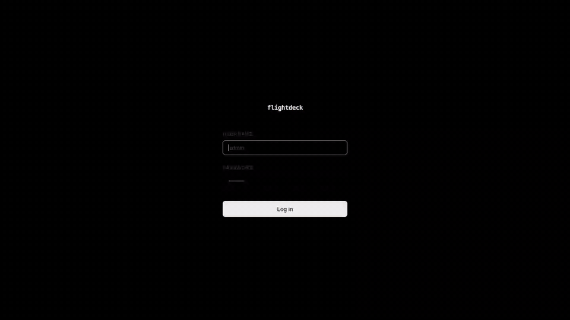
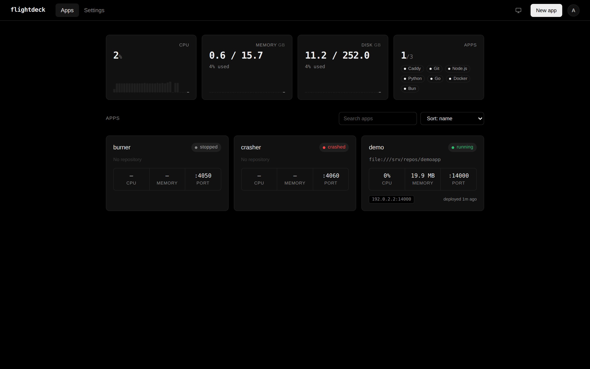
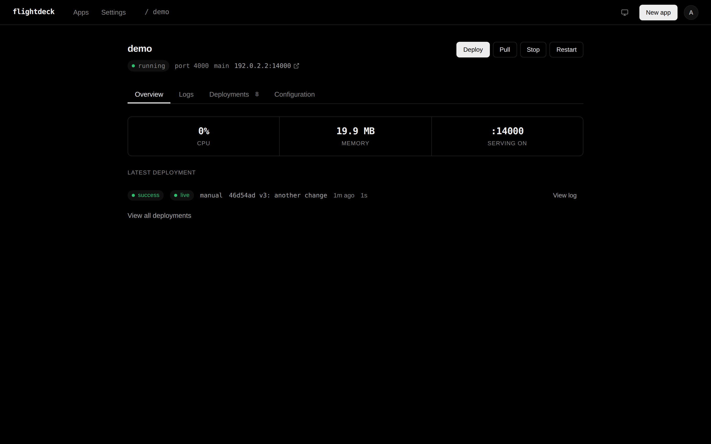
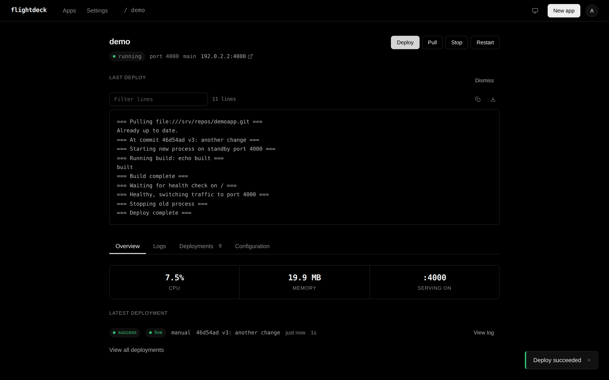
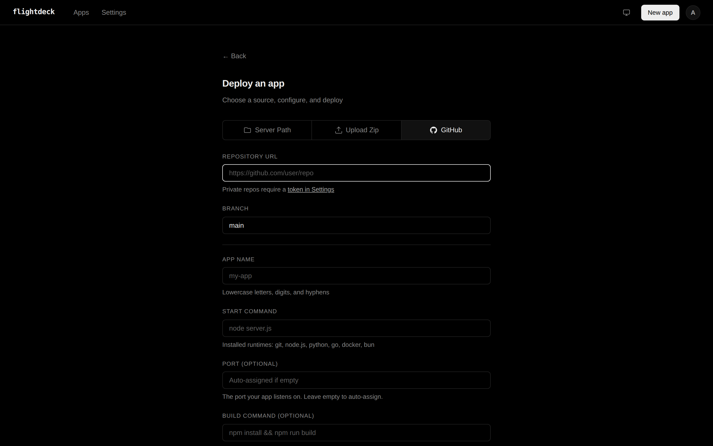
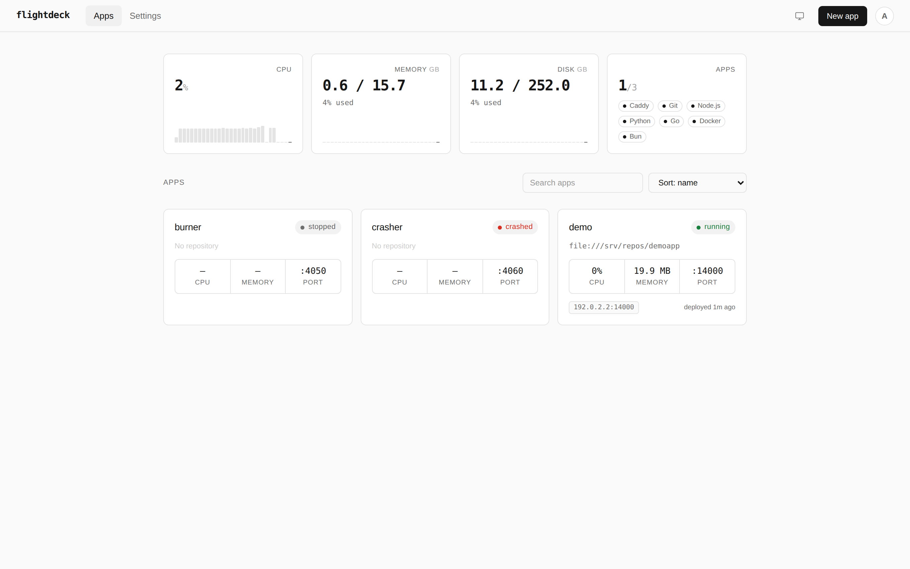

# flightdeck

[](https://github.com/sahithvibudhi/flightdeck/actions/workflows/ci.yml)
[](https://github.com/sahithvibudhi/flightdeck/releases)
[](LICENSE)
[](https://goreportcard.com/report/github.com/sahithvibudhi/flightdeck)

One binary. One command. Your VPS, under control.

Flightdeck is a control plane for indie developers who deploy to a VPS. Install it on a $5 server, open the dashboard, and deploy apps with automatic SSL, push-to-deploy webhooks, zero-downtime restarts, and crash recovery. No Docker required.

```bash
curl -sSL https://raw.githubusercontent.com/sahithvibudhi/flightdeck/main/scripts/install.sh | sudo bash
```

Then open `http://your-server-ip:3000` and create your admin account in the browser. That's the whole install.



## Why flightdeck?

Most deployment tools assume you're running Kubernetes, or Docker, or a managed platform that costs $20/month per app. Coolify, great as it is, wants 2 CPUs and 2 GB of RAM before your apps start, because the platform itself is a PHP app plus PostgreSQL plus Redis plus workers. If you're an indie hacker shipping a side project on a cheap VPS, the platform shouldn't be your biggest tenant.

Flightdeck is one **17 MB static binary** that idles at about **15 MB of RAM**. Your 512 MB VPS stays yours.

**No Docker.** This is intentional. Docker adds memory overhead, image build times, and complexity that doesn't pay off when you're running a few apps on a small server. Flightdeck runs your code directly, the same way you'd run it if you SSH'd in and typed `node server.js`.

**No lock-in, no platform risk.** Everything lives in SQLite next to a single binary. Your apps are plain OS processes: if flightdeck stops, crashes, or is upgraded, **your apps keep serving traffic**. Flightdeck re-adopts the running processes when it comes back. If you stop using flightdeck entirely, your apps are still just processes on your server.

**Small attack surface.** One Go binary, one SQLite file, Caddy for TLS. No exposed database, no queue, no PHP runtime. Login is rate-limited, webhooks are HMAC-signed, and the setup endpoint permanently closes after first use.

## How it compares

| | flightdeck | Coolify | Dokploy | Kamal | Piku |
|---|---|---|---|---|---|
| Platform footprint (idle) | **~15 MB RAM** | 500-700 MB RAM | ~350 MB RAM | none (CLI) | minimal |
| Requires Docker | **No** | Yes | Yes | Yes | No |
| Web dashboard | **Yes** | Yes | Yes | No | No |
| Install | 1 command + browser | 1 command | 1 command | Ruby gem + config | git hooks setup |
| Zero-downtime deploys | **Yes** (health-checked) | Partial | Yes | Yes | No |
| Push-to-deploy webhooks | **Yes** | Yes | Yes | No (CLI push) | git push |
| Apps survive platform restart | **Yes** (process adoption) | Containers keep running | Containers keep running | Yes | Yes |
| Automatic SSL | **Yes** (Caddy) | Yes (Traefik/Caddy) | Yes (Traefik) | Yes (kamal-proxy) | Yes (acme.sh) |
| Minimum server | **512 MB** | 2 GB | 1 GB | any | 256 MB |

If you want 280+ one-click services, teams, and multi-server orchestration, use Coolify. It's excellent at that scale. Flightdeck is for the other case: a couple of apps, one cheap VPS, and no patience for platform overhead.

## What it does

- **Deploy apps** from GitHub, a zip upload, or a directory already on the server
- **Push-to-deploy**: every app gets an HMAC-signed webhook URL; push to GitHub and it pulls, rebuilds, restarts
- **Zero-downtime deploys**: set a health check path and deploys start the new process, wait for it to pass, switch traffic, then stop the old one
- **Live deploy logs**: watch pull, build, health check, and traffic switch stream stage by stage while a deploy runs; every deployment keeps its full log
- **One-click rollback** to any previous successful deployment
- **Crash recovery**: processes that die are restarted with exponential backoff; persistent failures are marked crashed with the reason in the logs
- **Automatic SSL** via Caddy reverse proxy: add a domain and certificates just work
- **Live logs** streamed to the dashboard over SSE, with filtering, follow/pause, and download
- **Deployment history** showing what triggered each deploy, the commit, duration, and which one is serving right now
- **Notifications** to Discord, Telegram, or any webhook on deploy success, failure, and crashes
- **Environment variables** per app, managed from the UI
- **Build commands** like `npm install && npm run build` before start
- **Process control**: start, stop, restart from the dashboard; stop reaches the whole process group
- **Server monitoring**: CPU, memory, disk with sparkline trends, plus per-app CPU and memory
- **Runtime management**: detect and install Node, Python, Go, Bun, Deno, Caddy, and git from Settings
- **Survives itself**: flightdeck restarts and upgrades never touch your running apps

## Screenshots

The dashboard, with every app's status, resource usage, and URL:



An app's page, with tabs for logs, deployments, and configuration:



Deploys stream their build output live, stage by stage:



Deploying is one form:



There's a light theme too: follow the OS or pick one from the navbar:



## Install

```bash
curl -sSL https://raw.githubusercontent.com/sahithvibudhi/flightdeck/main/scripts/install.sh | sudo bash
```

The installer downloads the binary for your architecture (amd64/arm64), verifies its checksum, installs git and Caddy, sets up a systemd service, and starts it. Finish setup in the browser at `http://your-server-ip:3000`. Missed dependencies can always be installed later from the Settings page.

Prefer the terminal? Run `sudo flightdeck` interactively and the setup wizard runs there instead. Automating with cloud-init or Ansible? Set `FLIGHTDECK_ADMIN_USER` and `FLIGHTDECK_ADMIN_PASSWORD` in the service environment and setup is fully headless.

**Requirements:** a Linux VPS (amd64 or arm64), ports 80/443 open for SSL, port 3000 for the dashboard (or put it behind a domain in Settings).

### Uninstall

```bash
curl -sSL https://raw.githubusercontent.com/sahithvibudhi/flightdeck/main/scripts/uninstall.sh | sudo bash
```

Your data in `/var/flightdeck` is kept unless you pass `--purge`, and running apps are not stopped.

## Deploying an app

Navigate to **Deploy**, pick a source tab:

- **GitHub**: clone a repository (private repos work with a token from Settings)
- **Upload Zip**: drag and drop a `.zip`
- **Server Path**: run an app from a directory already on the server

Fill in the app name and start command, optionally a build command, port, health check path, and environment variables. One click and you're watching the live deploy log.

To enable push-to-deploy, copy the webhook URL from the app page into your GitHub repo's webhook settings. Every push pulls, rebuilds, and restarts, with zero downtime if you set a health check.

## Docs

- [Architecture](docs/ARCHITECTURE.md): how the single binary, Caddy, SQLite, and app processes fit together
- [API reference](docs/API.md): every endpoint, including webhooks and the SSE log stream
- [Roadmap](docs/ROADMAP.md): what's next and what's deliberately out of scope
- [Research](docs/RESEARCH.md): the competitive analysis behind flightdeck's positioning
- [Contributing](CONTRIBUTING.md): conventions, project structure, and the OrbStack workflow
- [Security policy](SECURITY.md): threat model and how to report vulnerabilities

## Tech stack

| Component | Choice |
|---|---|
| Language | Go |
| UI | React + TypeScript (Vite), embedded via go:embed |
| Database | SQLite (modernc.org/sqlite, pure Go) |
| Reverse proxy | Caddy (subprocess, auto SSL) |
| Router | chi |
| Auth | bcrypt + JWT, per-IP login rate limiting |
| Process management | os/exec, process groups, PID adoption |

## Roadmap

Postgres/Redis provisioning with scheduled backups, cron jobs, deploy notifications (Discord/Telegram), and an MCP server for agent-driven deploys are next. See [docs/ROADMAP.md](docs/ROADMAP.md) for the full plan.

## License

[MIT](LICENSE)
